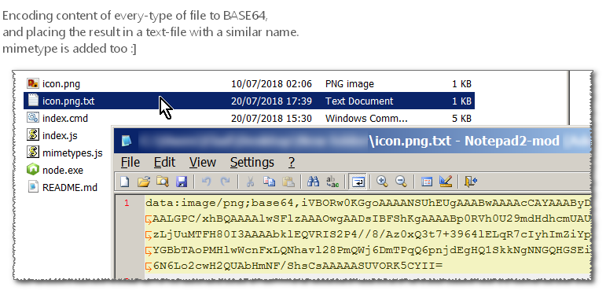

<h1> ConsoleBase64</h1>

Two variations (C# and NodeJS) on <strong>a program that encodes files'-content to a BASE64 string</strong>.  

 

Both C# and NodeJS add an internet-media-type (mimetype) based on a collection of ext-to-mimetype I've assembled (more accurate, updated and complete than Apache's latest <code>media.types</code>),  
and it will "fallback" to using <code>application/octet-stream</code> if no match was found. 

The C# variation is a bit older (2012) and buggy if you don't put the file in the same folder,  
it uses the STDOUT for the content output, and some of the batch-files in the same folder help with encoding  
a large amount of files at the same time.  

 

The <strong>NodeJS variation</strong> - newer and comes with a copy of <code>node.exe</code> (x86 for maximum-compatibility, with a modified embedded manifest),  
and no dependencies. read and write is done directly to/from files, with-miminal command-line interaction.  

